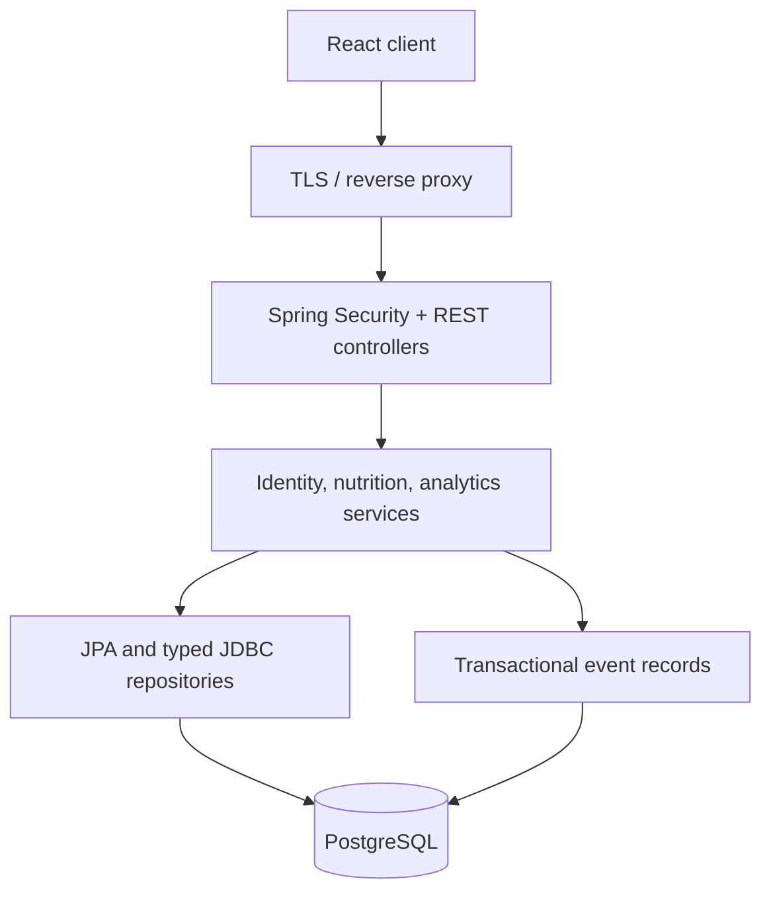

# Fitflix architecture
A modular monolith: React/TypeScript → same-origin reverse proxy → Spring Boot → PostgreSQL. The Java service owns identity, nutrition calculations, authorization and event collection. React never holds secrets or calculates authoritative totals. Flyway versions the database; Hibernate validates the schema.

Authentication: BCrypt(12) password hashes; 15-minute signed JWT access token kept in memory; 30-day opaque rotating refresh token in Secure, HttpOnly, SameSite=Strict cookie. Only its SHA-256 digest is stored. JWT session ID is checked against the database on every request so logout revokes access immediately. Refresh/logout require exact allowed Origin. CORS is an allowlist. Identity always comes from authenticated JWT; client user IDs never select private records. Admin roles come from the database, never registration input.

Deployment: Nginx serves the React build and proxies /api to the Java container. PostgreSQL lives on a private network with a persistent volume. Credentials are required environment variables. Backups, TLS, alerting and provider accounts are operator launch gates. Sites' Worker runtime cannot execute a Java server; do not substitute a different backend or claim a static preview is this full-stack deployment.

Frontend: pages contain flows, shared components contain presentation, services owns authenticated HTTP and session refresh. TanStack Query invalidates server state after mutations. React Router protects all application routes and enforces onboarding; server rules remain authoritative.

Backend: controllers → validated DTOs → transactional services → repositories/entities. Database constraints enforce identity, uniqueness, references, ranges. Exceptions return structured validation errors. Readiness is /actuator/health/readiness (including database connectivity). Auth rate limiting is a single-instance implementation; distributed hosting must add edge or Redis throttling.

## Current recovery decisions
Preserved the existing auth architecture rather than replacing verified session flows. Cookie-authenticated refresh/logout require the exact Origin; registration/login reject foreign browser origins; resource mutations require a bearer token that browsers do not attach automatically. CORS remains restricted. All new routes are versioned under /api/v1, with old aliases retained. Plain cookie-only application sessions were preferred in the brief but were not mandatory; existing rotating sessions are database-persistent and verified. Compatibility cookie/database/Java identifiers retain fitplix.

WellnessController delegates recipes, serving conversions and workouts to WellnessService and WellnessRepository. The latter uses parameterized JDBC for bounded catalog and workout queries, while recovered identity/nutrition continue using JPA. New ownership queries always include the authenticated user ID. Recipe ingredients refer to existing source foods; meal logging continues through the existing nutrition snapshot service.

V6 is additive. The Compose migration job exits after Spring/Flyway validates and migrates; the serving API has migrations disabled. Java 21 is pinned as the compilation target. No destructive migrations were added. Sources and environment references are in indian-nutrition.md and environment.md. Local workflow and deployment assumptions are in README.md and infra/README.md.

Password recovery: `POST /api/auth/forgot-password` queues both known and unknown addresses and returns the same generic response. A bounded single-worker queue performs lookup and SMTP outside the request path; queue saturation returns 503. A per-user database lock and one-minute cooldown serialize issuance across instances. Only SHA-256 hashes of 48-byte random tokens persist in `password_reset` (V5); expiry is 15 minutes. SMTP failure rolls back issuance and emits a redacted operational error. The queue is in-memory: an interrupted request must be retried after restart. The email uses configured APP_ORIGIN, never a request Host header. Its token is in the URL fragment; the frontend removes it from history on load and submits it in a POST body. `POST /api/auth/reset-password` atomically consumes the token, updates BCrypt, and revokes every session. Login takes the same user lock to avoid creating a session from stale credentials during reset. MAIL_ENABLED defaults false and yields account-neutral 503; configure an authenticated TLS SMTP provider before launch. Native PostgreSQL multi-connection locking still requires CI/host verification.
