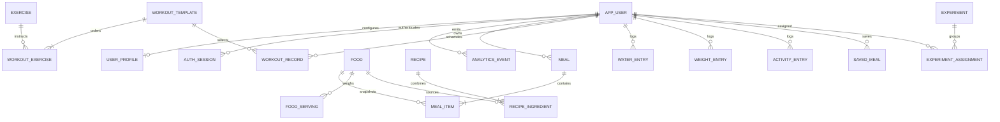

# Database model
Flyway migrations in `backend/src/main/resources/db/migration` are the authoritative PostgreSQL schema. UUIDs identify records; owner IDs are indexed; all event timestamps are UTC timestamptz. User-facing calendar dates are explicitly interpreted in the profile timezone.

Nutrition totals are derived rather than mutable aggregate rows. Logged nutrients and targets are snapshotted so subsequent catalog/goal changes do not rewrite past adherence. UserProfile is the current fitness goal; historical target snapshots are attached to meals. Favorite foods and meal templates are owner scoped. Demo users have an explicit marker and are excluded from real-user product metrics.

V6 introduces fixed-decimal serving/ingredient gram quantities, foreign keys to source foods, authored workout/exercise catalogs and user/date-indexed completion records. A unique user/template/date constraint makes repeated scheduling safe. User deletion cascades through workouts; public catalogs remain. Existing nutrition fields retain double precision, explicitly documented as a limitation; no risky type rewrite of prior data was performed.
